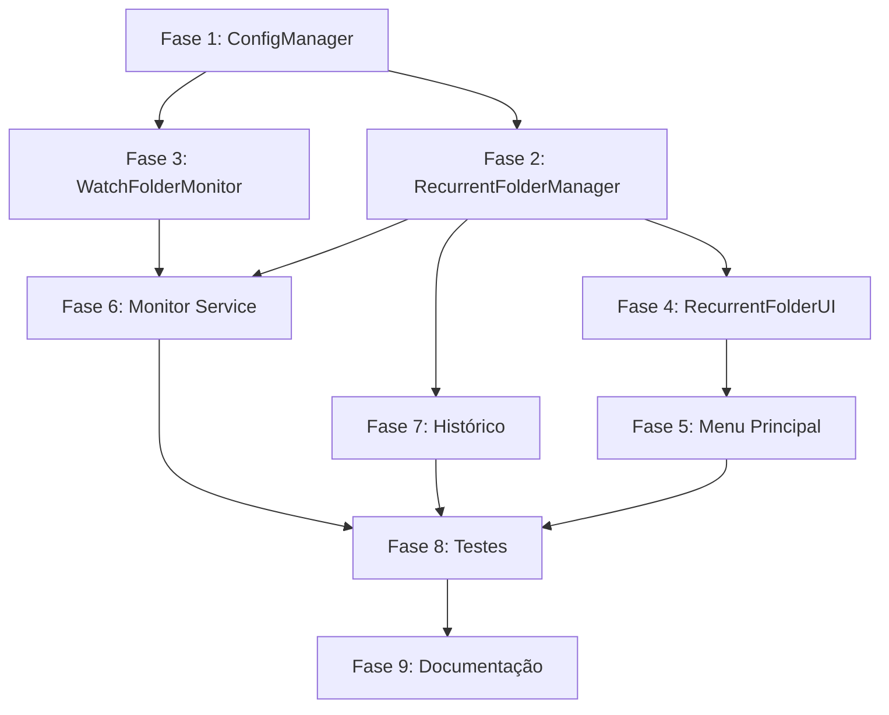

# Plano de Implementação: Codificação de Pasta Única vs Recorrente

## Visão Geral

Este documento descreve as fases de implementação para adicionar as funcionalidades de codificação única e recorrente de pastas.

## Fases de Implementação

### Fase 1: Estrutura de Dados e ConfigManager

**Agente Responsável:** Backend Specialist

**Descrição:** Implementar a estrutura de dados para configurações recorrentes e estender o ConfigManager.

**Tarefas:**
1. [ ] Adicionar campo `recurrent_folders` ao DEFAULT_CONFIG no [`ConfigManager`](src/managers/config_manager.py:9)
2. [ ] Criar métodos `get_recurrent_folders()`, `add_recurrent_folder()`, `remove_recurrent_folder()`, `update_recurrent_folder()`
3. [ ] Criar função utilitária para gerar UUIDs para cada pasta recorrente
4. [ ] Atualizar [`config.example.json`](config.example.json) com exemplo de recurrent_folders

**Arquivos para modificar:**
- [`src/managers/config_manager.py`](src/managers/config_manager.py)
- [`config.example.json`](config.example.json)

**Entregáveis:**
- ConfigManager estendido com métodos para gerenciar pastas recorrentes
- Estrutura de dados consistente com a especificação

---

### Fase 2: RecurrentFolderManager

**Agente Responsável:** Backend Specialist

**Descrição:** Criar o gerenciador central para operações de pastas recorrentes.

**Tarefas:**
1. [ ] Criar nova classe `RecurrentFolderManager` em [`src/managers/recurrent_folder_manager.py`](src/managers/recurrent_folder_manager.py)
2. [ ] Implementar CRUD de configurações (add, remove, update, list, get)
3. [ ] Implementar métodos enable/disable_folder
4. [ ] Adicionar validação de configurações (caminhos válidos, profile existe)
5. [ ] Implementar persistência de histórico de processamento

**Arquivos para criar:**
- [`src/managers/recurrent_folder_manager.py`](src/managers/recurrent_folder_manager.py)

**Dependências:**
- Fase 1 concluída

---

### Fase 3: WatchFolderMonitor

**Agente Responsável:** Backend Specialist

**Descrição:** Implementar o sistema de monitoramento de diretórios.

**Tarefas:**
1. [ ] Criar classe `WatchFolderMonitor` em [`src/core/watch_folder_monitor.py`](src/core/watch_folder_monitor.py)
2. [ ] Implementar detecção de novos arquivos usando watchdog ou polling
3. [ ] Implementar debounce para arquivos sendo copiados (esperar arquivo estar completo)
4. [ ] Implementar verificações: extensão suportada, tamanho mínimo, skip_existing
5. [ ] Integrar com QueueManager para enqueue automático de jobs
6. [ ] Implementar start/stop de monitores individuais
7. [ ] Adicionar logging de atividades

**Arquivos para criar:**
- [`src/core/watch_folder_monitor.py`](src/core/watch_folder_monitor.py)

**Dependências:**
- Fase 1 concluída
- QueueManager existente

---

### Fase 4: RecurrentFolderUI

**Agente Responsável:** Frontend Specialist

**Descrição:** Criar interface de usuário para gerenciamento de pastas recorrentes.

**Tarefas:**
1. [ ] Criar classe `RecurrentFolderUI` em [`src/ui/recurrent_folder_ui.py`](src/ui/recurrent_folder_ui.py)
2. [ ] Implementar menu de listagem de pastas recorrentes
3. [ ] Implementar formulário de adição de nova pasta recorrente
4. [ ] Implementar edição de pasta existente
5. [ ] Implementar remoção com confirmação
6. [ ] Implementar toggle enable/disable
7. [ ] Implementar start/stop de monitores
8. [ ] Implementar visualização de histórico de processamento
9. [ ] Adicionar validações de entrada (caminhos, perfil)

**Arquivos para criar:**
- [`src/ui/recurrent_folder_ui.py`](src/ui/recurrent_folder_ui.py)

**Dependências:**
- Fase 2 concluída
- Menu existente como referência

---

### Fase 5: Modificações no Menu Principal

**Agente Responsável:** Frontend Specialist

**Descrição:** Atualizar o menu principal para incluir as novas opções.

**Tarefas:**
1. [ ] Modificar [`run_interactive_mode()`](src/cli.py:848) para separar opção de pasta em única/recorrente
2. [ ] Adicionar submenu para "Codificação de Pasta" com:
   - 1.1 Codificação Única (chama `run_folder_conversion_cli`)
   - 1.2 Codificação Recorrente (chama `RecurrentFolderUI`)
3. [ ] Adicionar opção "Gerenciar Conversões Recorrentes" no menu principal
4. [ ] Atualizar numeração das opções subsequentes
5. [ ] Criar função `run_folder_conversion_submenu()` para encapsular o submenu

**Arquivos para modificar:**
- [`src/cli.py`](src/cli.py)
- [`src/ui/menu.py`](src/ui/menu.py) (se necessário novos métodos)

**Dependências:**
- Fase 4 concluída

---

### Fase 6: Monitor Service (Orquestração)

**Agente Responsável:** Backend Specialist

**Descrição:** Criar serviço que gerencia todos os monitores ativos.

**Tarefas:**
1. [ ] Criar classe `RecurrentMonitorService` em [`src/services/recurrent_monitor_service.py`](src/services/recurrent_monitor_service.py)
2. [ ] Implementar start_all_monitors() que lê configurações e inicia cada WatchFolderMonitor
3. [ ] Implementar stop_all_monitors()
4. [ ] Implementar auto-start ao iniciar o app (opcional, baseado em config)
5. [ ] Implementar graceful shutdown
6. [ ] Adicionar método para status de todos os monitores

**Arquivos para criar:**
- [`src/services/recurrent_monitor_service.py`](src/services/recurrent_monitor_service.py)

**Dependências:**
- Fase 3 concluída
- Fase 2 concluída

---

### Fase 7: Histórico e Estatísticas

**Agente Responsável:** Backend Specialist

**Descrição:** Implementar sistema de histórico de processamento para pastas recorrentes.

**Tarefas:**
1. [ ] Criar estrutura de dados para histórico (JSON ou SQLite)
2. [ ] Implementar registro de cada arquivo processado (input, output, status, duration, timestamp)
3. [ ] Criar método para listar histórico por pasta recorrente
4. [ ] Adicionar estatísticas específicas (total processado,成功率, etc.)
5. [ ] Integrar com StatsManager existente se aplicável

**Arquivos para criar:**
- [`src/managers/recurrent_history_manager.py`](src/managers/recurrent_history_manager.py)

**Dependências:**
- Fase 2 concluída

---

### Fase 8: Integração e Testes

**Agente Responsável:** Security & QA Tester

**Descrição:** Realizar testes de integração e validação.

**Tarefas:**
1. [ ] Testar fluxo completo de adição de pasta recorrente
2. [ ] Testar detecção automática de novos arquivos
3. [ ] Testar persistência de configurações após restart
4. [ ] Testar start/stop de monitores
5. [ ] Testar tratamento de erros (caminhos inválidos, perfil deletado, etc.)
6. [ ] Testar concorrência (múltiplas pastas monitorando simultaneamente)
7. [ ] Testar performance com muitos arquivos
8. [ ] Validar UI e usabilidade

**Arquivos para criar:**
- [`tests/test_recurrent_folder.py`](tests/test_recurrent_folder.py)
- [`tests/test_watch_monitor.py`](tests/test_watch_monitor.py)

**Dependências:**
- Todas as fases anteriores concluídas

---

### Fase 9: Documentação

**Agente Responsável:** Documentation Specialist

**Descrição:** Criar documentação para usuários e desenvolvedores.

**Tarefas:**
1. [ ] Atualizar README.md com novas funcionalidades
2. [ ] Criar guia de uso para codificação recorrente
3. [ ] Documentar estrutura de configuração
4. [ ] Adicionar exemplos de uso
5. [ ] Criar troubleshooting guide para problemas comuns

**Arquivos para criar:**
- [`docs/RECURRENT_FOLDER_GUIDE.md`](docs/RECURRENT_FOLDER_GUIDE.md)

**Dependências:**
- Todas as fases de implementação concluídas

---

## Diagrama de Dependências

---

## Resumo de Arquivos

### Arquivos para Criar

| Arquivo | Descrição | Fase |
|---------|-----------|------|
| `src/managers/recurrent_folder_manager.py` | Gerenciador de pastas recorrentes | 2 |
| `src/core/watch_folder_monitor.py` | Monitor de diretórios | 3 |
| `src/ui/recurrent_folder_ui.py` | UI de gerenciamento | 4 |
| `src/services/recurrent_monitor_service.py` | Serviço de orquestração | 6 |
| `src/managers/recurrent_history_manager.py` | Histórico de processamento | 7 |
| `tests/test_recurrent_folder.py` | Testes unitários | 8 |
| `tests/test_watch_monitor.py` | Testes de monitor | 8 |
| `docs/RECURRENT_FOLDER_GUIDE.md` | Documentação | 9 |

### Arquivos para Modificar

| Arquivo | Modificação | Fase |
|---------|-------------|------|
| `src/managers/config_manager.py` | Adicionar métodos recurrent_folders | 1 |
| `config.example.json` | Adicionar exemplo recurrent_folders | 1 |
| `src/cli.py` | Modificar menu principal | 5 |
| `src/ui/menu.py` | Adicionar métodos se necessário | 5 |
| `README.md` | Atualizar documentação | 9 |

---

## Critérios de Conclusão

- [ ] Todas as 9 fases completadas
- [ ] Testes passando
- [ ] Documentação atualizada
- [ ] Funcionalidade de codificação única preservada
- [ ] Funcionalidade de codificação recorrente operacional
- [ ] Menu de gerenciamento funcional
- [ ] Configurações persistidas corretamente
