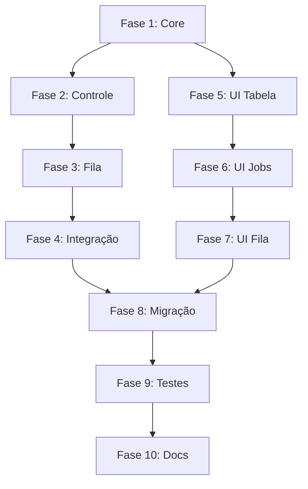

# Queue System Implementation Plan

## Visão Geral

Este plano descreve a implementação do novo sistema unificado de gerenciamento de fila, substituindo os atuais `QueueManager` e `JobManager` por um `UnifiedQueueManager` integrado, com uma interface de usuário completamente redesenhada.

## Fases de Implementação

### Fase 1: Core do UnifiedQueueManager

**Agente Responsável:** Backend Specialist

**Descrição:** Implementar a classe principal do gerenciador de fila unificado com todas as funcionalidades básicas de gerenciamento de jobs.

**Tarefas:**
1. [ ] Criar `src/managers/unified_queue_manager.py` com:
   - [ ] Classe `JobStatus` (enum)
   - [ ] Classe `QueuePriority` (enum)
   - [ ] Classe `QueueJob` (dataclass)
   - [ ] Classe `UnifiedQueueManager`
2. [ ] Implementar métodos de gerenciamento de jobs:
   - [ ] `add_job()` - Adicionar job à fila
   - [ ] `remove_job()` - Remover job da fila
   - [ ] `get_job()` - Obter detalhes do job
   - [ ] `get_job_details()` - Obter dicionário completo do job
3. [ ] Implementar persistência:
   - [ ] `save()` - Salvar estado no JSON
   - [ ] `load()` - Carregar estado do JSON
   - [ ] Migração de dados antigos
4. [ ] Implementar thread safety com locks

**Arquivos Criados:**
- `src/managers/unified_queue_manager.py`

**Arquivos Modificados:**
- Nenhum (nova implementação)

---

### Fase 2: Controle de Execução de Jobs

**Agente Responsável:** Backend Specialist

**Descrição:** Implementar funcionalidades de controle de execução (pausar, retomar, cancelar) e integração com hardware.

**Tarefas:**
1. [ ] Implementar métodos de controle:
   - [ ] `pause_job()` - Pausar job específico
   - [ ] `resume_job()` - Retomar job pausado
   - [ ] `cancel_job()` - Cancelar job
   - [ ] `retry_job()` - Retentar job falhado
2. [ ] Implementar detecção de hardware:
   - [ ] `_calculate_max_concurrent_jobs()` - Calcular limite baseado em hardware
   - [ ] `can_start_new_job()` - Verificar se pode iniciar novo job
   - [ ] `register_active_job()` - Registrar job ativo
   - [ ] `unregister_active_job()` - Desregistrar job ativo
3. [ ] Implementar callbacks:
   - [ ] `register_status_callback()` - Registrar callback de status
   - [ ] `register_progress_callback()` - Registrar callback de progresso
   - [ ] `_trigger_status_callback()` - Acionar callback de status
   - [ ] `_trigger_progress_callback()` - Acionar callback de progresso
4. [ ] Implementar cálculo de métricas:
   - [ ] `_calculate_elapsed_time()` - Calcular tempo decorrido
   - [ ] `_calculate_eta()` - Calcular ETA
   - [ ] `_calculate_speed()` - Calcular velocidade
   - [ ] `_update_resource_usage()` - Atualizar uso de recursos

**Arquivos Criados:**
- Nenhum

**Arquivos Modificados:**
- `src/managers/unified_queue_manager.py` (continuação)

---

### Fase 3: Gerenciamento de Fila

**Agente Responsável:** Backend Specialist

**Descrição:** Implementar funcionalidades de gerenciamento da fila (reordenar, prioridade, limpar, estatísticas).

**Tarefas:**
1. [ ] Implementar métodos de fila:
   - [ ] `list_queue()` - Listar jobs com filtros e ordenação
   - [ ] `reorder_job()` - Reordenar job na fila
   - [ ] `set_job_priority()` - Alterar prioridade do job
   - [ ] `clear_queue()` - Limpar fila completa ou por status
2. [ ] Implementar controle da fila:
   - [ ] `pause_queue()` - Pausar processamento da fila
   - [ ] `resume_queue()` - Retomar processamento da fila
   - [ ] `is_queue_paused()` - Verificar status de pausa
3. [ ] Implementar estatísticas:
   - [ ] `get_statistics()` - Estatísticas completas da fila
   - [ ] `get_queue_length()` - Tamanho da fila
   - [ ] `get_active_jobs_count()` - Contagem de jobs ativos
4. [ ] Implementar métodos utilitários:
   - [ ] `export_to_json()` - Exportar para arquivo JSON
   - [ ] `import_from_json()` - Importar de arquivo JSON
   - [ ] `cleanup_history()` - Limpar histórico antigo

**Arquivos Criados:**
- Nenhum

**Arquivos Modificados:**
- `src/managers/unified_queue_manager.py` (continuação)

---

### Fase 4: Integração com EncoderEngine

**Agente Responsável:** Backend Specialist

**Descrição:** Integrar o `UnifiedQueueManager` com o `EncoderEngine` existente para processamento automático da fila.

**Tarefas:**
1. [ ] Criar método `process_queue()`:
   - [ ] Loop principal de processamento
   - [ ] Verificação de jobs pendentes
   - [ ] Adição automática de jobs ao EncoderEngine
   - [ ] Remoção de jobs completados
2. [ ] Integrar callbacks do EncoderEngine:
   - [ ] Callback de progresso
   - [ ] Callback de status
   - [ ] Callback de conclusão
3. [ ] Implementar thread de processamento:
   - [ ] Thread background para processamento
   - [ ] Start/stop do processamento
   - [ ] Tratamento de erros
4. [ ] Criar testes de integração

**Arquivos Criados:**
- `tests/test_unified_queue.py`

**Arquivos Modificados:**
- `src/core/encoder_engine.py` (adicionar métodos de integração se necessário)

---

### Fase 5: UI - Tabela e Visualização da Fila

**Agente Responsável:** Frontend Specialist

**Descrição:** Redesenhar completamente a interface da fila com tabela detalhada e informações em tempo real.

**Tarefas:**
1. [ ] Criar `src/ui/queue_menu_v2.py` com:
   - [ ] Classe `QueueMenuUIV2`
   - [ ] Método `show_submenu()` - Menu principal
2. [ ] Implementar tabela detalhada:
   - [ ] `_show_queue_table()` - Tabela completa com todas as colunas
   - [ ] Colunas: Job ID, Input, Output, Perfil, Status, Progresso, Tempo, ETA, Velocidade, Tamanho, Prioridade
   - [ ] Formatação condicional por status
3. [ ] Implementar detalhes do job:
   - [ ] `_show_job_details()` - Painel com detalhes completos
   - [ ] Exibir todas as informações do job
   - [ ] Incluir uso de recursos (GPU, CPU, VRAM, RAM)
4. [ ] Implementar formatação utilitária:
   - [ ] `_get_status_display()` - Ícone e cor do status
   - [ ] `_format_duration()` - Formatar duração (HH:MM:SS)
   - [ ] `_format_file_size()` - Formatar tamanho de arquivo
   - [ ] `_format_percentage()` - Formatar porcentagem com barra

**Arquivos Criados:**
- `src/ui/queue_menu_v2.py`

**Arquivos Modificados:**
- Nenhum

---

### Fase 6: UI - Menu de Gerenciamento de Jobs

**Agente Responsável:** Frontend Specialist

**Descrição:** Implementar menus de gerenciamento individual de jobs com todas as ações disponíveis.

**Tarefas:**
1. [ ] Implementar submenu de gerenciamento:
   - [ ] `_manage_individual_job()` - Selecionar job para gerenciar
   - [ ] `_show_job_management_options()` - Opções do job
2. [ ] Implementar ações de controle:
   - [ ] `_cancel_job_confirmation()` - Confirmar e cancelar job
   - [ ] `_pause_job()` - Pausar job
   - [ ] `_resume_job()` - Retomar job
   - [ ] `_retry_job()` - Retentar job falhado
3. [ ] Implementar gerenciamento de prioridade:
   - [ ] `_change_priority_submenu()` - Mudar prioridade
   - [ ] `_reorder_job_submenu()` - Reordenar na fila
4. [ ] Implementar visualização de detalhes:
   - [ ] `_view_job_logs()` - Ver logs do job
   - [ ] `_view_job_resources()` - Ver uso de recursos em tempo real

**Arquivos Criados:**
- Nenhum

**Arquivos Modificados:**
- `src/ui/queue_menu_v2.py` (continuação)

---

### Fase 7: UI - Menu de Gerenciamento da Fila

**Agente Responsável:** Frontend Specialist

**Descrição:** Implementar menu de gerenciamento geral da fila com ações em lote.

**Tarefas:**
1. [ ] Implementar ações em lote:
   - [ ] `_pause_queue()` - Pausar toda a fila
   - [ ] `_resume_queue()` - Retomar toda a fila
   - [ ] `_clear_queue_submenu()` - Limpar fila completa
   - [ ] `_clear_completed_submenu()` - Limpar apenas completados
2. [ ] Implementar processamento:
   - [ ] `_process_queue_with_monitor()` - Processar fila com monitor
   - [ ] `_start_background_processing()` - Iniciar processamento em background
3. [ ] Implementar estatísticas visuais:
   - [ ] `_show_queue_statistics()` - Painel de estatísticas
   - [ ] Gráficos de distribuição por status
   - [ ] Gráficos de distribuição por prioridade
4. [ ] Implementar monitoramento em tempo real:
   - [ ] `_show_live_monitor()` - Monitor ao vivo com Rich Live
   - [ ] Atualização automática de progresso
   - [ ] Exibição de uso de recursos

**Arquivos Criados:**
- Nenhum

**Arquivos Modificados:**
- `src/ui/queue_menu_v2.py` (continuação)

---

### Fase 8: Migração e Compatibilidade

**Agente Responsável:** Backend Specialist

**Descrição:** Implementar sistema de migração dos antigos `QueueManager` e `JobManager` para o novo `UnifiedQueueManager`.

**Tarefas:**
1. [ ] Criar script de migração:
   - [ ] `src/utils/queue_migration.py`
   - [ ] Detectar arquivos antigos
   - [ ] Converter jobs antigos para novo formato
   - [ ] Preservar histórico
2. [ ] Implementar migração automática:
   - [ ] Executar migração no init do `UnifiedQueueManager`
   - [ ] Criar backup dos arquivos antigos
   - [ ] Validar dados migrados
3. [ ] Atualizar imports no projeto:
   - [ ] Substituir `QueueManager` por `UnifiedQueueManager`
   - [ ] Substituir `JobManager` por `UnifiedQueueManager`
   - [ ] Atualizar `src/ui/menu.py`
   - [ ] Atualizar `src/cli.py`
4. [ ] Manter compatibilidade retroativa:
   - [ ] Criar wrappers para API antiga (deprecada)
   - [ ] Adicionar warnings de deprecação

**Arquivos Criados:**
- `src/utils/queue_migration.py`

**Arquivos Modificados:**
- `src/ui/menu.py`
- `src/cli.py`
- `src/managers/__init__.py`

---

### Fase 9: Testes e Validação

**Agente Responsável:** Security & QA Tester

**Descrição:** Criar testes abrangentes para validar todas as funcionalidades do novo sistema.

**Tarefas:**
1. [ ] Criar testes unitários:
   - [ ] Testes para `UnifiedQueueManager`
   - [ ] Testes para `QueueJob`
   - [ ] Testes para enums
2. [ ] Criar testes de integração:
   - [ ] Teste com `EncoderEngine`
   - [ ] Teste com `HardwareMonitor`
   - [ ] Teste de persistência
3. [ ] Criar testes de UI:
   - [ ] Teste de renderização de tabela
   - [ ] Teste de menus interativos
4. [ ] Testes de carga:
   - [ ] Teste com 100+ jobs na fila
   - [ ] Teste de concorrência máxima
   - [ ] Teste de estresse de persistência

**Arquivos Criados:**
- `tests/test_unified_queue_manager.py`
- `tests/test_unified_queue_ui.py`

**Arquivos Modificados:**
- Nenhum

---

### Fase 10: Documentação

**Agente Responsável:** Documentation Specialist

**Descrição:** Criar documentação completa do novo sistema de fila.

**Tarefas:**
1. [ ] Documentação da API:
   - [ ] `docs/QUEUE_API.md` - API completa do `UnifiedQueueManager`
   - [ ] Exemplos de uso
   - [ ] Guia de migração
2. [ ] Atualizar README:
   - [ ] Seção de gerenciamento de fila
   - [ ] Exemplos de comandos
3. [ ] Guia do usuário:
   - [ ] `docs/QUEUE_USER_GUIDE.md` - Como usar a fila
   - [ ] Explicação de prioridades
   - [ ] Dicas de otimização
4. [ ] Documentação técnica:
   - [ ] `docs/QUEUE_ARCHITECTURE.md` - Arquitetura do sistema
   - [ ] Diagramas atualizados
   - [ ] Decisões de design

**Arquivos Criados:**
- `docs/QUEUE_API.md`
- `docs/QUEUE_USER_GUIDE.md`
- `docs/QUEUE_ARCHITECTURE.md`

**Arquivos Modificados:**
- `README.md`

---

## Resumo das Fases

| Fase | Descrição | Agente | Arquivos Criados |
|------|-----------|--------|------------------|
| 1 | Core do UnifiedQueueManager | Backend Specialist | 1 |
| 2 | Controle de Execução | Backend Specialist | 0 |
| 3 | Gerenciamento de Fila | Backend Specialist | 0 |
| 4 | Integração EncoderEngine | Backend Specialist | 1 |
| 5 | UI - Tabela e Visualização | Frontend Specialist | 1 |
| 6 | UI - Menu de Jobs | Frontend Specialist | 0 |
| 7 | UI - Menu da Fila | Frontend Specialist | 0 |
| 8 | Migração e Compatibilidade | Backend Specialist | 1 |
| 9 | Testes e Validação | Security & QA Tester | 2 |
| 10 | Documentação | Documentation Specialist | 3 |

**Total de Arquivos Criados:** 9
**Total de Arquivos Modificados:** 4

## Dependências entre Fases

## Critérios de Aceitação

1. **Funcionalidade Completa:**
   - Todos os métodos especificados implementados
   - Integração com EncoderEngine funcionando
   - UI responsiva e informativa

2. **Thread Safety:**
   - Todas as operações protegidas por locks
   - Callbacks executados em threads separadas
   - Sem race conditions

3. **Persistência:**
   - Dados salvos corretamente no JSON
   - Migração de dados antigos funcionando
   - Recuperação após crash

4. **Performance:**
   - Suporte a 100+ jobs na fila
   - Atualizações de UI sem lag
   - Auto-save não bloqueante

5. **Compatibilidade:**
   - Migração automática de dados
   - API antiga mantida (deprecada)
   - Perfis existentes compatíveis
