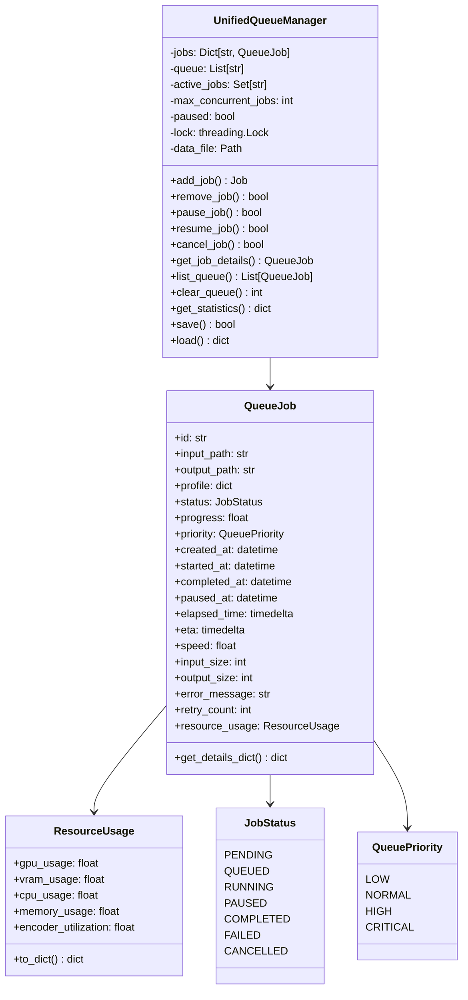
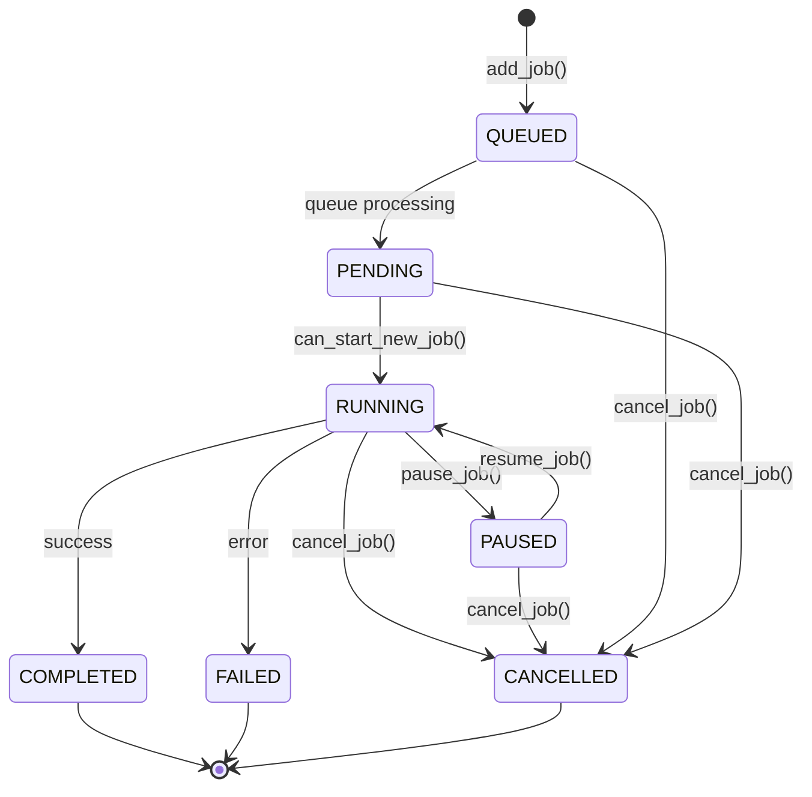
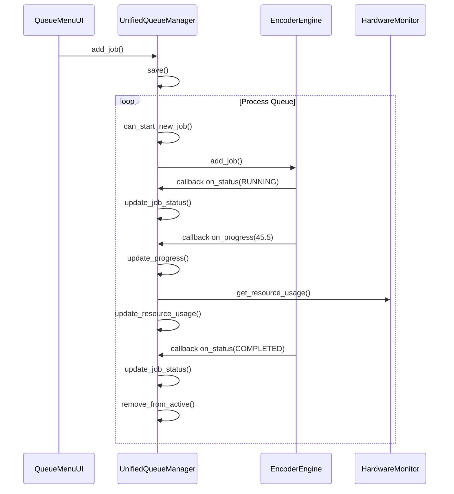

# Queue System Specification

## Visão Geral

Este documento especifica a arquitetura do novo sistema de gerenciamento de fila de encoding, unificando as funcionalidades do `QueueManager`, `JobManager` e `EncoderEngine` em um sistema coeso e robusto.

## Problemas Atuais Identificados

1. **Falta de sincronização**: O `QueueManager` e `JobManager` operam de forma independente, causando inconsistências de estado
2. **Gerenciamento de estado frágil**: Jobs podem ficar em estados inconsistentes entre a fila e o gerenciador de jobs
3. **UI desatualizada**: A interface não reflete em tempo real o estado dos jobs
4. **Controle limitado**: Funcionalidades de pausar, retomar e cancelar não são totalmente integradas
5. **Falta de detalhes**: Jobs não exibem informações completas sobre execução, recursos e histórico

## Nova Arquitetura

### Diagrama de Arquitetura



### Fluxo de Vida do Job



## Estrutura de Dados

### QueueJob - Detalhes Completos

Um job na nova fila terá os seguintes campos:

| Campo | Tipo | Descrição |
|-------|------|-----------|
| `id` | str | UUID único do job |
| `input_path` | str | Caminho completo do arquivo de entrada |
| `output_path` | str | Caminho completo do arquivo de saída |
| `profile` | dict | Configurações do perfil de encoding |
| `profile_name` | str | Nome legível do perfil |
| `status` | str | Status atual (JobStatus) |
| `progress` | float | Progresso em porcentagem (0-100) |
| `priority` | int | Nível de prioridade (1-4) |
| `created_at` | str | Timestamp ISO de criação |
| `started_at` | str | Timestamp ISO de início |
| `paused_at` | str | Timestamp ISO de pausa (se aplicável) |
| `resumed_at` | str | Timestamp ISO de retomada (se aplicável) |
| `completed_at` | str | Timestamp ISO de conclusão |
| `elapsed_time` | str | Tempo total decorrido (HH:MM:SS) |
| `eta` | str | Tempo estimado para conclusão (HH:MM:SS) |
| `speed` | float | Velocidade de encoding (%/min) |
| `input_size` | int | Tamanho do arquivo de entrada (bytes) |
| `output_size` | int | Tamanho do arquivo de saída (bytes) |
| `compression_ratio` | float | Razão de compressão |
| `error_message` | str | Mensagem de erro (se falhou) |
| `retry_count` | int | Contador de tentativas |
| `resource_usage` | dict | Uso de recursos (GPU, CPU, VRAM, RAM) |
| `ffmpeg_pid` | int | PID do processo FFmpeg |
| `log_file` | str | Caminho para arquivo de log |

### Exemplo de Job Detalhado

```json
{
  "id": "550e8400-e29b-41d4-a716-446655440000",
  "input_path": "C:/Videos/raw/video_001.mp4",
  "output_path": "C:/Videos/encoded/video_001_h264.mp4",
  "profile": {
    "id": "h264_1080p",
    "name": "H.264 1080p",
    "codec": "h264_nvenc",
    "resolution": "1920x1080",
    "bitrate": "8000K",
    "preset": "p5",
    "crf": 23
  },
  "profile_name": "H.264 1080p",
  "status": "running",
  "progress": 45.5,
  "priority": 2,
  "created_at": "2026-04-01T10:30:00",
  "started_at": "2026-04-01T10:35:00",
  "paused_at": null,
  "resumed_at": null,
  "completed_at": null,
  "elapsed_time": "00:15:30",
  "eta": "00:18:45",
  "speed": 2.9,
  "input_size": 2147483648,
  "output_size": 524288000,
  "compression_ratio": 0.244,
  "error_message": null,
  "retry_count": 0,
  "resource_usage": {
    "gpu_usage": 85.5,
    "vram_usage": 4.2,
    "cpu_usage": 25.0,
    "memory_usage": 1.5,
    "encoder_utilization": 92.0
  },
  "ffmpeg_pid": 12345,
  "log_file": "jobs/logs/550e8400-e29b-41d4-a716-446655440000.log"
}
```

## API do UnifiedQueueManager

### Métodos Principais

```python
class UnifiedQueueManager:
    # Gerenciamento de Jobs
    def add_job(
        input_path: str,
        output_path: str,
        profile: dict,
        priority: QueuePriority = QueuePriority.NORMAL
    ) -> QueueJob
    
    def remove_job(job_id: str) -> bool
    def get_job(job_id: str) -> Optional[QueueJob]
    def get_job_details(job_id: str) -> dict
    
    # Controle de Execução
    def pause_job(job_id: str) -> bool
    def resume_job(job_id: str) -> bool
    def cancel_job(job_id: str) -> bool
    def retry_job(job_id: str) -> Optional[str]  # Retorna novo job_id
    
    # Gerenciamento de Fila
    def list_queue(
        status_filter: Optional[JobStatus] = None,
        sort_by: str = "priority",
        ascending: bool = False
    ) -> List[QueueJob]
    
    def reorder_job(job_id: str, new_position: int) -> bool
    def set_job_priority(job_id: str, priority: QueuePriority) -> bool
    def clear_queue(status_filter: Optional[JobStatus] = None) -> int
    
    # Controle da Fila
    def pause_queue() -> bool
    def resume_queue() -> bool
    def is_queue_paused() -> bool
    
    # Estatísticas e Informações
    def get_statistics() -> dict
    def get_queue_length() -> int
    def get_active_jobs_count() -> int
    def can_start_new_job() -> bool
    
    # Persistência
    def save() -> bool
    def load() -> dict
    def export_to_json(filepath: str) -> bool
    def import_from_json(filepath: str) -> int
```

## Integração com EncoderEngine

O `UnifiedQueueManager` será integrado ao `EncoderEngine` através de callbacks:



## Estrutura do Arquivo de Persistência

```json
{
  "version": "2.0",
  "last_updated": "2026-04-01T15:45:00",
  "queue_paused": false,
  "max_concurrent_jobs": 4,
  "jobs": {
    "job_id_1": { ... },
    "job_id_2": { ... }
  },
  "queue_order": ["job_id_1", "job_id_2"],
  "active_jobs": ["job_id_1"],
  "history": {
    "completed": ["job_id_0"],
    "failed": [],
    "cancelled": []
  }
}
```

## Considerações de Thread Safety

- Todas as operações de leitura/escrita serão protegidas por `threading.Lock`
- Callbacks serão executados em thread separada para não bloquear a fila
- Atualizações de UI serão feitas via thread-safe queue

## Compatibilidade

O novo sistema manterá compatibilidade com:
- Perfis existentes (`profiles/profiles.json`)
- Diretório de jobs (`jobs/`)
- Callbacks de progresso e status do `EncoderEngine`
